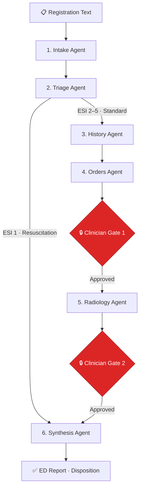

<p align="center">
  
  
  
  
  
  
</p>

<h1 align="center">Ibn Sina (ابن سينا)</h1>
<h3 align="center">Agentic AI Decision-Support System for Paediatric Emergency Departments</h3>

<p align="center">
  A LangGraph multi-agent state machine that automates the full paediatric ED encounter workflow—from triage and clinical history through chest X-ray analysis to diagnostic synthesis and disposition—with mandatory clinician-in-the-loop safety gates at every critical decision point.
</p>

<p align="center">
  <a href="https://ibn-sina-lemon.vercel.app"><strong>Live Demo ↗</strong></a> · <a href="https://ibnsina-production.up.railway.app/docs"><strong>API Docs ↗</strong></a> · <a href="#-local-development"><strong>Get Started ↗</strong></a>
</p>

> [!CAUTION]
> **Research prototype — NOT a medical device.** Operates exclusively on synthetic patient data. Every AI-generated recommendation requires explicit clinician review and approval. No output from this system should inform real clinical decisions.

---

## Table of Contents

- [Why Ibn Sina](#-why-ibn-sina)
- [How It Works](#-how-it-works)
- [Clinical Safety Design](#-clinical-safety-design)
- [Architecture](#-architecture)
- [API Reference](#-api-reference)
- [Local Development](#-local-development)
- [Testing](#-testing)
- [Project Structure](#-project-structure)
- [Key Design Decisions](#-key-design-decisions)
- [License](#-license)

---

## 💡 Why Ibn Sina

Paediatric pneumonia remains the **leading infectious cause of death** in children under 5 globally (WHO). Emergency departments face triage bottlenecks, cognitive overload from parallel data streams, inconsistent application of severity criteria, and heavy documentation burden.

Ibn Sina addresses this by providing a **structured, auditable, AI-assisted clinical workflow** that standardises severity assessment using internationally recognised guidelines—while keeping the clinician in full control of every critical decision.

**Key differentiators:**
- 🔒 **Clinician-in-the-loop gates** — the AI cannot bypass human review at critical junctures
- 🧮 **Zero-hallucination scoring** — all severity metrics computed by deterministic Python, never by an LLM
- 👁️ **Multi-modal CXR vision** — Gemini Flash reads chest X-rays with structured findings and mandatory limitation disclosures
- 💸 **Zero inference cost** — runs entirely on free-tier APIs (Groq + Google AI Studio)

---

## ⚙️ How It Works

The system models a real paediatric ER visit as a **6-stage LangGraph `StateGraph`** with ESI-based conditional routing and two `interrupt_before` clinician approval gates.



| Stage | Agent | Model | What It Does |
|:---:|---|---|---|
| **1** | Intake | Groq · Llama 3.3 70B | Parses free-text registration into structured demographics, insurance, and chief complaint |
| **2** | Triage | Groq · Llama 3.3 70B | Evaluates vitals against age-stratified WHO ranges, assigns ESI level (1–5), flags red flags |
| **3** | History | Groq · Llama 3.3 70B | Generates structured HPI, PMH, medications, allergies, birth/immunisation history, SOAP note |
| **4** | Orders | Groq · Llama 3.3 70B | Selects from curated LOINC lab panels (CBC, CRP, Procalcitonin, Lactate) + AP chest X-ray |
| **5** | Radiology | Gemini · Flash (Vision) | Reads uploaded CXR images with structured findings, pneumonia likelihood, and limitations |
| **6** | Synthesis | Gemini · Flash (Reasoning) | Aggregates all data → differential diagnosis, deterministic severity score, disposition, full ED report |

**Conditional routing:** ESI Level 1 (resuscitation) bypasses history/orders/radiology and routes directly to synthesis for immediate escalation.

**Clinician gates:** The graph halts at two points—before radiology and before synthesis—requiring the clinician to **accept**, **edit**, or **reject** the AI's proposals before execution continues.

---

## 🛡️ Clinical Safety Design

### Deterministic severity scoring — no LLM involvement

All clinical scores are computed by **pure Python functions** in [`api/clinical/scores.py`](api/clinical/scores.py). The LLM explains a score; it never calculates one.

| Scoring Framework | Criteria Evaluated |
|---|---|
| **WHO Paediatric Danger Signs** | Unable to drink, convulsions, altered consciousness (AVPU), chest indrawing, grunting, nasal flaring, head bobbing, hypoxaemia (SpO₂ < 92%), poor perfusion (CRT ≥ 3s) |
| **PIDS/IDSA Severe CAP** | SpO₂ < 92%, RR above age threshold, altered mental status, multilobar infiltrates, pleural effusion, elevated lactate (≥ 2.0 mmol/L) |
| **Age-stratified reference ranges** | RR upper limits: 60 (0–2 mo) · 50 (2–12 mo) · 40 (1–5 yr) — HR thresholds similarly stratified |

### Deterministic disposition rules

Disposition is computed by [`api/clinical/rules.py`](api/clinical/rules.py), not by the LLM:

| Condition | Decision |
|---|---|
| WHO `very_severe` classification | **Admit PICU** |
| WHO `severe` OR ≥ 2 override triggers | **Admit Ward** |
| Single override or social risk factor | **Observation** |
| Non-severe, no overrides | **Discharge Home** (follow-up in 2 days) |

Override triggers include: hypoxaemia, inability to feed, altered consciousness, age < 6 months, incomplete immunisations, recurrent LRTI, concurrent anaemia, and social vulnerability factors.

### Immutable audit trail

Every agent proposal, clinician approval/edit/rejection, CXR upload, and graph transition is logged to an append-only `audit_log` table in PostgreSQL via [`api/db.py`](api/db.py).

### CXR vision safety framing

The radiology agent is explicitly prompted as a **narrative assistant to a radiologist**—not a diagnostic classifier. It must follow a structured search pattern (airway → lungs → pleura → cardiac → bones → soft tissue), state limitations on every read, and never output numeric probabilities.

---

## 🏗️ Architecture

```
┌──────────────────────────────────────────────────────────────────┐
│  Frontend · Vercel                                               │
│  Next.js 15 (App Router) · React 19 · TypeScript · Chakra UI v3 │
└──────────────────────┬───────────────────────────────────────────┘
                       │ REST API
┌──────────────────────▼───────────────────────────────────────────┐
│  Backend · Railway                                               │
│  FastAPI · Pydantic v2 · Uvicorn                                 │
│  ┌─────────────────────────────────────────────────────────┐     │
│  │  LangGraph StateGraph                                   │     │
│  │  6 agents · 2 interrupt gates · ESI conditional routing │     │
│  └─────────────────────────────────────────────────────────┘     │
│  ┌──────────────────┐  ┌──────────────────────────────────┐     │
│  │  Clinical Engine  │  │  LLM Router (llm.py)             │     │
│  │  scores.py        │  │  fast  → Groq (+ Gemini fallback)│     │
│  │  rules.py         │  │  reason→ Gemini (+ Groq fallback)│     │
│  │  panels.py        │  │  vision→ Gemini only             │     │
│  └──────────────────┘  └──────────────────────────────────┘     │
└──────────────────────┬───────────────────────────────────────────┘
                       │
┌──────────────────────▼───────────────────────────────────────────┐
│  Database · Supabase PostgreSQL                                  │
│  encounters table · audit_log table · PostgresSaver checkpoints  │
└──────────────────────────────────────────────────────────────────┘
```

| Layer | Stack |
|---|---|
| **Frontend** | Next.js 15, React 19, TypeScript, Chakra UI v3, Lucide Icons, Emotion |
| **Backend** | Python 3.12+, FastAPI, Pydantic v2, Uvicorn |
| **Agentic Workflow** | LangGraph StateGraph, LangChain Core |
| **LLM Inference** | Groq (`llama-3.3-70b-versatile`), Google Gemini (`gemini-2.5-flash` / `gemini-3.6-flash`) |
| **Database** | Supabase PostgreSQL, `PostgresSaver` with `psycopg` connection pool |
| **Telemetry** | AgentOps SDK |
| **Deployment** | Railway (API · Docker multi-stage), Vercel (Web), Nixpacks |

### LLM provider routing with automatic fallback

The [`api/llm.py`](api/llm.py) module implements a single router that silently absorbs rate-limit errors (429s) and reroutes to a fallback provider. A SHA-256 prompt-hash disk cache prevents redundant LLM calls for identical inputs.

---

## 📡 API Reference

| Method | Endpoint | Purpose |
|---|---|---|
| `GET` | `/health` | Liveness check → `{ status, service, version }` |
| `GET` | `/encounters` | List active encounters for the tracking board |
| `POST` | `/encounter` | Register new encounter → `{ raw_registration, vitals? }` |
| `GET` | `/encounter/{id}` | Full encounter state + graph status |
| `POST` | `/encounter/{id}/run` | Execute graph to next gate or completion |
| `POST` | `/encounter/{id}/approve` | Clinician approval → `{ gate, approved_by, action, edits? }` |
| `POST` | `/upload/cxr/{id}` | Upload CXR image (multipart/form-data) |

Full interactive documentation available at [`/docs`](https://ibnsina-production.up.railway.app/docs) (Swagger UI).

---

## 💻 Local Development

### Prerequisites

- Python 3.10+ &ensp;·&ensp; Node.js 18+ &ensp;·&ensp; Docker (optional)

### Quick start

```bash
# Clone
git clone https://github.com/nour-hatem/IbnSina.git && cd IbnSina

# Configure environment
cp .env.example .env
# Edit .env with your API keys (see table below)
```

### Option A — Docker Compose (recommended)

```bash
docker compose up --build
```

| Service | URL |
|---|---|
| Frontend | http://localhost:3000 |
| Backend API | http://localhost:8000 |
| Swagger Docs | http://localhost:8000/docs |

### Option B — Manual

```bash
# Backend
python3 -m venv venv && source venv/bin/activate
pip install -r api/requirements.txt
uvicorn api.main:app --reload --port 8000

# Frontend (separate terminal)
cd web && npm install && npm run dev
```

### Environment variables

| Variable | Description | Source |
|---|---|---|
| `GOOGLE_API_KEY` | Gemini Flash (vision + reasoning) | [Google AI Studio](https://aistudio.google.com/apikey) |
| `GROQ_API_KEY` | Llama 3.3 70B (fast text agents) | [Groq Console](https://console.groq.com/keys) |
| `SUPABASE_URL` | Supabase project URL | Supabase Dashboard → Settings → API |
| `SUPABASE_SERVICE_KEY` | Service role key | Supabase Dashboard → Settings → API |
| `SUPABASE_DB_URL` | PostgreSQL connection string | Supabase Dashboard → Settings → Database |
| `CORS_ORIGINS` | Allowed origins (comma-separated) | `http://localhost:3000` for local dev |

---

## 🧪 Testing

```bash
python -m pytest           # 21 tests — all passing ✅
cd web && npm run lint     # 0 errors, 0 warnings ✅
cd web && npm run build    # TypeScript strict mode — clean ✅
```

| Suite | Tests | Coverage |
|---|---|---|
| `test_scores.py` | 19 | WHO danger signs, age-stratified RR/HR thresholds, PIDS/IDSA severity classification, edge cases (borderline SpO₂, neonate ranges, multilobar + hypoxaemia) |
| `test_graph.py` | 2 | Graph compilation, all 6 nodes correctly wired |

---

## 📂 Project Structure

```
IbnSina/
├── api/                            # FastAPI backend + LangGraph state machine
│   ├── agents/                     # 6 autonomous clinical agent nodes
│   │   ├── intake.py               #   Registration text → structured demographics
│   │   ├── triage.py               #   Vitals → ESI level + red flags
│   │   ├── history.py              #   Free text → HPI, PMH, SOAP note
│   │   ├── orders.py               #   Curated LOINC lab panel selection
│   │   ├── radiology.py            #   Gemini vision CXR reading
│   │   └── synthesis.py            #   Differential, severity, disposition, ED report
│   ├── clinical/                   # Deterministic Python clinical algorithms
│   │   ├── scores.py               #   WHO danger signs + PIDS/IDSA scoring
│   │   ├── rules.py                #   Disposition override rules
│   │   └── panels.py               #   Curated lab panel definitions (Tier 1 + 2)
│   ├── db.py                       # Supabase persistence + audit logging
│   ├── graph.py                    # StateGraph wiring, checkpointer, ESI routing
│   ├── llm.py                      # LLM provider router with fallback chains
│   ├── main.py                     # FastAPI routes + CORS
│   ├── schemas.py                  # Pydantic state schema (30+ typed fields)
│   ├── telemetry.py                # AgentOps initialisation
│   ├── Dockerfile                  # Multi-stage Docker build
│   └── requirements.txt            # Python dependencies
├── web/                            # Next.js 15 frontend
│   └── src/
│       ├── app/                    # Pages: Encounter Board, About
│       ├── components/             # EncounterBoard, ClinicalGateApproval,
│       │                           # NewEncounterModal, CXRUploader, EdReportView
│       ├── lib/                    # API client, TypeScript types
│       └── theme/                  # Chakra UI custom theme
├── tests/                          # Pytest suite (21 tests)
├── eval/                           # Synthetic evaluation case records
├── docker-compose.yml              # Local container orchestration
├── nixpacks.toml                   # Railway build config
└── README.md
```

---

## 🧠 Key Design Decisions

| Decision | Rationale |
|---|---|
| **LLM explains, Python computes** | Severity scores and disposition are never LLM-generated, eliminating the most dangerous class of hallucination in clinical AI |
| **Append-only audit fields** | `approvals` and `errors` use LangGraph's `Annotated[list, add]` reducer — no agent can overwrite previous entries |
| **Curated lab panels, not free generation** | The orders agent selects from pre-defined LOINC-coded panels, preventing hallucinated lab tests; Tier 2 labs unlock only when severity warrants |
| **Graceful degradation everywhere** | Supabase, AgentOps, and PostgresSaver each degrade to working fallbacks rather than crashing the system |
| **Cannot-miss differential enforcement** | The synthesis agent must explicitly address 7 cannot-miss diagnoses (foreign body aspiration, bacterial/viral pneumonia, pleural effusion, pneumothorax, myocarditis, sepsis) even if only to exclude them |
| **Free-tier only inference** | Groq + Google AI Studio free tiers make the system accessible for research with zero API cost |

---

## 📜 License

Distributed under the MIT License. See [`LICENSE`](LICENSE) for details.
